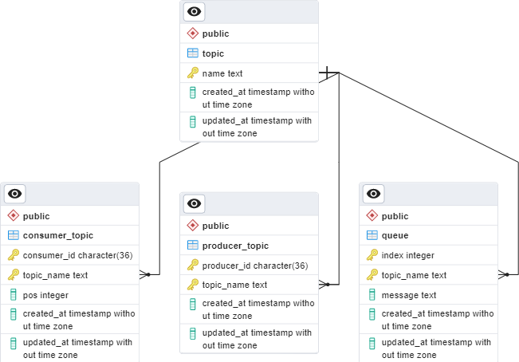

## Tech Stack
+ **FastAPI** is a modern, fast (high-performance) web framework for building APIs with Python 3.7+ based on standard Python type hints. It is designed to be easy to use and compatible with the latest version of Python, while providing high performance and ease of deployment. 
+ **PostgreSQL**is a powerful, open source, object-relational database system with a strong reputation for reliability, feature robustness, and performance. PostgreSQL is fully ACID (Atomicity, Consistency, Isolation, Durability) compliant, which means that it ensures data integrity and consistency even in the face of failures or errors.
+ **Docker** is a containerization platform that makes it easier to create, deploy, and run applications by using containers. It provides portability, isolation, scalability, reproducability. Hence, we have dockerized our server. 

## Implementation Approach

Database : Postgresql ; Server : Uvicorn + FastAPI (for endpoints)

We chose fastAPI due to it being a very lightweight library and also lighting fast.

Uvicorn is one of the most popular ASGI server and works well with fastAPI and has a very detailed and good documentation.

PostgresSQL is one of the most advanced and free SQL database with a lot of advanced features,logging and a huge community.

We put exception handling in place and handled any issues with the database updates by rolling back the updates so that the database is always in a consistent state. We made sure a producer cannot access a topic they are not registered for.

### Handling Multiple Clients

#### Thread Locks

We can handle multiple client requests trying to access same data by implementing locks and restricting the access to a single thread(request) at a time to avoid inconsistencies.

The disadvantage however comes while maintaining the persistensy of database as just locks aren't enough to rollback the server in case of shutdown we needs logs and also a mechanism to revert back depending on those log. This basically means implenting core database features from scratch.

If we use threading locks, the CPU and memory on server keeps on increasing as the number of consumers and producers increases.

Another caveate of using this approach is with using fastAPI as fastAPI runs all the threads parallely from a main thread on different cores which means one will need to acquire and release the lock in the main thread for all the spawned threads to be able to access it. This can be solved using different library like flask but that comes with its own trade offs with performance.

#### Using Postgres

PostgresSQL and other similar sql databse takes care of these problems by using transactions i.e a command which is ran as whole and changes are rolled back in case of failure.

The simplest approach to using transactions is implementing all of the SQL queries for all api endpoints as transactions, however this means that at a time only one of the request will be served which might hamper performance greatly at large scale although postgres has inbuilt parallelisation for transactions.

Another better approach is to implement custom locks in SQL queries so as to only restrict the access for specific data which is being updated. This is in fact even better than using thread locks as it gives us the ability to lock certain rows of a table, while other rows can be modified.

For ex -  in /consumer/consume endpoint - requires (consumer_id,topic_name)

We need to

1. Get the offset of condumer for the given topic
2. Retrive message using the offset from topic queue
3. Increment the offset by one

If using thread locks: We need to acquire the lock before 1. and release after 3. This means no other consumer can consume parallely even if the consuer wants to consume from a different topic or same topic but different comsumer_id

Using custom database locks gives us the ability to lock only the rows in queue table which are being accessed during the query execution which allows a different topic queue to be accessed parallely.

## Tradeoffs

Apart from tradeoffs explained above some trade offs from our database schema choice are stated below

We used 4 different tables in the database schema :
Topic : name, timestamps corresponding to the create and update
Producer_Topic : producer_id, name, timestamps corresponding to the create and update
Consumer_Topic : consumer_id, name, pos(signifying the next log to be consumed), timestamps corresponding to the create and update
Queue : index (sorted according to this to maintain the FIFO order), message (log texts), topic name and the timestamps

We do not need a Topic table, as we could get all the listed topics by querying on the Producer_Topic but we used extra tables to make sure the queries are processed faster as the Producer_Topic table would typically be much larger than the Topic file.

## Testing
### API testing

Extensively tested all the endpoints cases of success and failure.

### Client library

Built the client library unit test suite using unittest mocking the responses using patch

### End to End

Multiple producer threads are made to log several messages from corresponding log files simultaneously to the broker and at the same time multiple consumers are made to poll for various topics consuming them whenever the log messages are available

## Challenges

Faced some issues while trying to make some of the database transactions atomic (for persistence), had to use db.rollback() in case of any issues with the update queries. Faced some issues with dockerization.

## ERD Diagram

